<h1 align="center">XLand-MiniGrid</h1>

<p align="center">
    <a href="https://pypi.python.org/pypi/xminigrid">
        
    </a>
    <a href="https://badge.fury.io/py/xminigrid">
        
    </a>
    <a href="https://github.com/astral-sh/ruff">
        
    </a>
    <a href="https://arxiv.org/abs/2312.12044">
        
    </a>
    <a href="https://twitter.com/vladkurenkov/status/1731709425524543550">
        
    </a>
    <a target="_blank" href="https://colab.research.google.com/github/corl-team/xland-minigrid/blob/main/examples/walkthrough.ipynb">
      
    </a>
</p>

[//]: # (    <a href="https://badge.fury.io/py/xminigrid">)

[//]: # (        )

[//]: # (    </a>)

[//]: # (    <a href="https://github.com/corl-team/xland-minigrid/main/LICENSE">)

[//]: # (        )

[//]: # (    </a>)

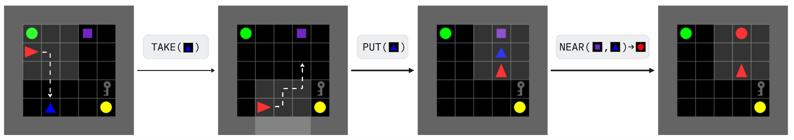

# Meta-Reinforcement Learning in JAX

[//]: # (> 🥳 **XLand-MiniGrid was [accepted]&#40;https://openreview.net/forum?id=xALDC4aHGz&#41; to [Intrinsically Motivated Open-ended Learning]&#40;https://imol-workshop.github.io&#41; workshop at NeurIPS 2023.** We look forward to seeing everyone at the poster session! )

> 🥳 We recently released [**XLand-100B**](https://github.com/dunno-lab/xland-minigrid-datasets), a large multi-task dataset for offline meta and in-context RL research, based on XLand-MiniGrid. 
It is currently the largest dataset for in-context RL, containing full learning histories for **30k unique tasks, 100B transitions, and 2.5B episodes**. Check it out!

**XLand-MiniGrid** is a suite of tools, grid-world environments and benchmarks for meta-reinforcement learning research inspired by 
the diversity and depth of [XLand](https://deepmind.google/discover/blog/generally-capable-agents-emerge-from-open-ended-play/) 
and the simplicity and minimalism of [MiniGrid](https://github.com/Farama-Foundation/MiniGrid). Despite the similarities, 
XLand-MiniGrid is written in JAX from scratch and designed to be highly scalable, democratizing large-scale experimentation 
with limited resources. Ever wanted to reproduce a [DeepMind AdA](https://sites.google.com/view/adaptive-agent/) agent? Now you can and not in months, but days!


### Features

- 🔮 System of rules and goals that can be combined in arbitrary ways to produce
diverse task distributions
- 🔧 Simple to extend and modify, comes with example environments ported from the original
[MiniGrid](https://github.com/Farama-Foundation/MiniGrid)
- 🪄 Fully compatible with all JAX transformations, can run on CPU, GPU and TPU
- 📈 Easily scales to $2^{16}$ parallel environments and millions of steps per second on a single GPU
- 🔥 Multi-GPU PPO baselines in the [PureJaxRL](https://github.com/luchris429/purejaxrl) style, which can achieve **1 trillion** environment steps under two days 

How cool is that? For more details, take a look at the [technical paper](https://arxiv.org/abs/2312.12044) or
[examples](examples), which will walk you through the basics and training your own adaptive agents in minutes!

[//]: # (![img]&#40;figures/times_minigrid.jpg&#41;)

## Installation 🎁

The latest release of XLand-MiniGrid can be installed directly from PyPI:

```commandline
pip install xminigrid
# or, from github directly
pip install "xminigrid @ git+https://github.com/corl-team/xland-minigrid.git"
```

Alternatively, if you want to install the latest development version from the GitHub and run provided algorithms or scripts,
install the source as follows:
```commandline
git clone git@github.com:corl-team/xland-minigrid.git
cd xland-minigrid

# additional dependencies for baselines
pip install -e ".[dev,baselines]"
```
Note that the installation of JAX may differ depending on your hardware accelerator! 
We advise users to explicitly install the correct JAX version (see the [official installation guide](https://github.com/google/jax#installation)).

## Basic Usage 🕹️

Most users who are familiar with other popular JAX-based environments 
(such as [gymnax](https://github.com/RobertTLange/gymnax) or [jumnaji](https://github.com/instadeepai/jumanji)), 
will find that the interface is very similar.
On the high level, current API combines [dm_env](https://github.com/google-deepmind/dm_env) and gymnax interfaces.

```python
import jax
import xminigrid
from xminigrid.wrappers import GymAutoResetWrapper
from xminigrid.experimental.img_obs import RGBImgObservationWrapper

key = jax.random.key(0)
reset_key, ruleset_key = jax.random.split(key)

# to list available benchmarks: xminigrid.registered_benchmarks()
benchmark = xminigrid.load_benchmark(name="trivial-1m")
# choosing ruleset, see section on rules and goals
ruleset = benchmark.sample_ruleset(ruleset_key)

# to list available environments: xminigrid.registered_environments()
env, env_params = xminigrid.make("XLand-MiniGrid-R9-25x25")
env_params = env_params.replace(ruleset=ruleset)

# auto-reset wrapper
env = GymAutoResetWrapper(env)

# render obs as rgb images if needed (warn: this will affect speed greatly)
env = RGBImgObservationWrapper(env)

# fully jit-compatible step and reset methods
timestep = jax.jit(env.reset)(env_params, reset_key)
timestep = jax.jit(env.step)(env_params, timestep, action=0)

# optionally render the state
env.render(env_params, timestep)
```
Similar to gymnasium or jumanji, users can register new environment 
variations with `register` for convenient further usage with `make`. 
`timestep` is a dataclass containing `step_type`, `reward`, `discount`, `observation`, as well as the internal environment `state`.

For a bit more advanced introduction see provided [walkthrough notebook](examples/walkthrough.ipynb).

### On environment interface

Currently, there are a lot of new JAX-based environments appearing, each offering its own variant of API. Initially, we tried to reuse Jumanji, but it turned out 
that its design [is not suitable for meta learning](https://github.com/instadeepai/jumanji/issues/212). The Gymnax design appeared to be more appropriate, but unfortunately it is not actively supported and
often departs from the idea that parameters should only be contained in `env_params`. Furthermore, splitting 
`timestep` into multiple entities seems suboptimal to us, as it complicates many things, such as envpool or dm_env 
style auto reset, where the reset occurs on the next step (we need access to done of previous step).

Therefore, we decided that we would make a minimal interface that would cover just our needs without the 
goal of making it generic. The core of our library is interface independent, and we plan 
to switch to the new one when/if a better design becomes available
(e.g. when stable Gymnasium [FuncEnv](https://gymnasium.farama.org/main/api/functional/) is released).

## Rules and Goals 🔮

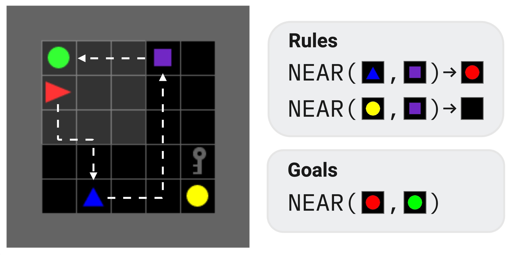

In XLand-MiniGrid, the system of rules and goals is the cornerstone of the 
emergent complexity and diversity. In the original MiniGrid 
some environments have dynamic goals, but the dynamics are never changed. 
To train and evaluate highly adaptive agents, we need to be able to change 
the dynamics in non-trivial ways. 

**Rules** are the functions that can change the environment state in some deterministic 
way according to the given conditions. **Goals** are similar to rules, except they do 
not change the state, they only test conditions. Every task should be described with a goal, rules and initial objects. We call these **rulesets**. 
Currently, we support only one goal per task. 

To illustrate, we provide visualization for specific ruleset. To solve this task, agent should take blue pyramid and put it near the purple square to transform both 
objects into red circle. To complete the goal, red circle should be placed near
green circle. However, placing purple square near yellow circle will make it unsolvable in this trial. Initial objects positions will be randomized on each reset. 

For more advanced introduction, see corresponding section in the provided [walkthrough notebook](examples/walkthrough.ipynb).
<br clear="right"/>

## Benchmarks 🎲 

While composing rules and goals by hand is flexible, it can quickly become cumbersome. 
Besides, it's hard to express efficiently in a JAX-compatible way due to the high number of heterogeneous computations 

To avoid significant overhead during training and facilitate reliable comparisons between agents, 
we pre-sampled several benchmarks with up to **three million unique tasks**, following the procedure used to train DeepMind 
AdA agent from the original XLand. Each task is represented with a tree, where root is a goal and all nodes are production rules, which should be triggered in a sequence to solve the task:

<p align="center">
  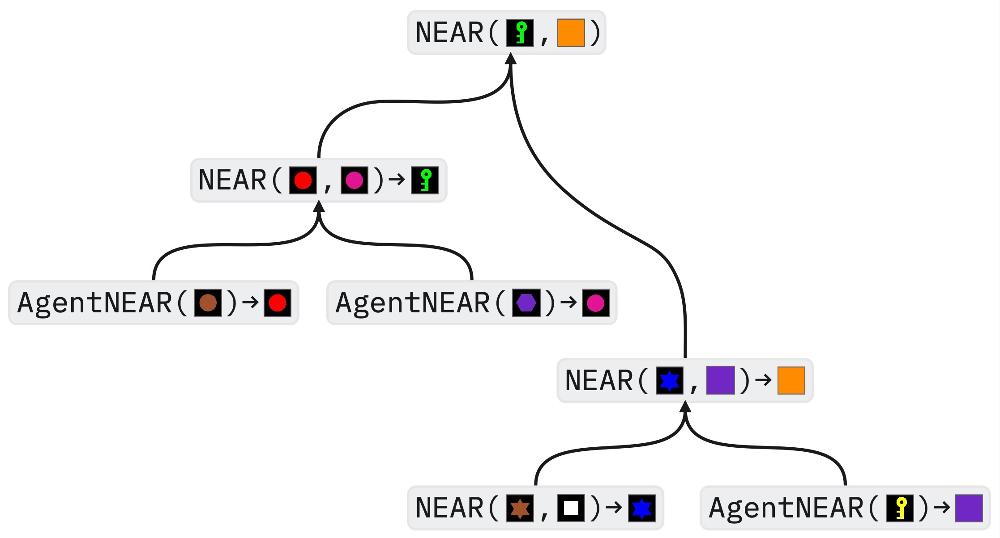
</p>

These benchmarks differ in the generation configs, producing distributions with
varying levels of diversity and average difficulty of the tasks. They can be used for different purposes, for example
the `trivial-1m` benchmark can be used to debug your agents, allowing very quick iterations. However, we would caution 
against treating benchmarks as a progression from simple to complex. They are just different 🤷.

Pre-sampled benchmarks are hosted on [HuggingFace](https://huggingface.co/datasets/Howuhh/xland_minigrid/tree/main) and will be downloaded and cached on the first use:

```python
import jax.random
import xminigrid
from xminigrid.benchmarks import Benchmark

# downloading to path specified by XLAND_MINIGRID_DATA,
# ~/.xland_minigrid by default
benchmark: Benchmark = xminigrid.load_benchmark(name="trivial-1m")
# reusing cached on the second use
benchmark: Benchmark = xminigrid.load_benchmark(name="trivial-1m")

# users can sample or get specific rulesets
benchmark.sample_ruleset(jax.random.key(0))
benchmark.get_ruleset(ruleset_id=benchmark.num_rulesets() - 1)

# or split them for train & test
train, test = benchmark.shuffle(key=jax.random.key(0)).split(prop=0.8)
```

We also provide the [script](scripts/ruleset_generator.py) used to generate these benchmarks. Users can use it for their own purposes:
```commandline
python scripts/ruleset_generator.py --help
```

In depth description of all available benchmarks is provided [in the technical paper](https://arxiv.org/abs/2312.12044) (Section 3).

## Environments 🌍

We provide environments from two domains. `XLand` is our main focus for meta-learning. For this domain we provide single
environment and numerous registered variants with different grid layouts and sizes. All of them can be combined
with arbitrary rulesets. 

To demonstrate the generality of our library we also port majority of 
non-language based tasks from original `MiniGrid`. Similarly, some environments come with multiple registered variants. 
However, we have no current plans to actively develop and support them (but that may change).

| Name | Domain  | Visualization                                            | Goal                                                                         |
|------|---------|----------------------------------------------------------|------------------------------------------------------------------------------|
|   `XLand-MiniGrid` | XLand   | 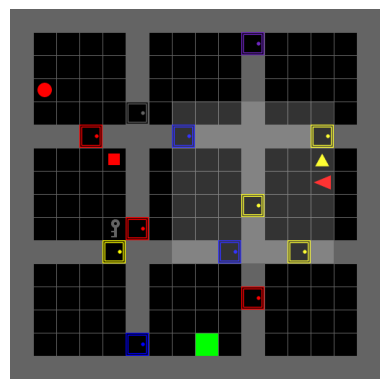               | specified by the provided ruleset                                            |
|   `MiniGrid-Empty`   | MiniGrid | 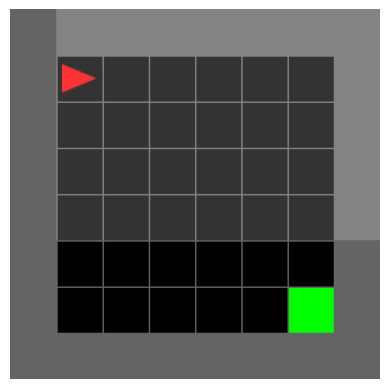               | go to the green goal                                                         |
|   `MiniGrid-EmptyRandom`   | MiniGrid | 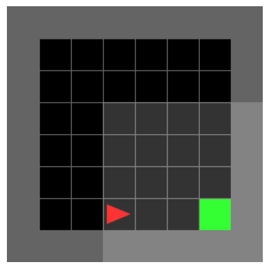        | go the green goal from different starting positions                          |
|   `MiniGrid-FourRooms`   | MiniGrid |            | go the green goal, but goal and starting positions are randomized            |
|   `MiniGrid-LockedRoom`   | MiniGrid | 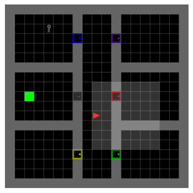          | find the key to unlock the door, go to the green goal                        |
|   `MiniGrid-Memory`   | MiniGrid | 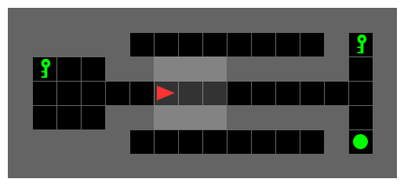              | remember the initial object and choose it at the end of the corridor         |
|   `MiniGrid-Playground`   | MiniGrid | 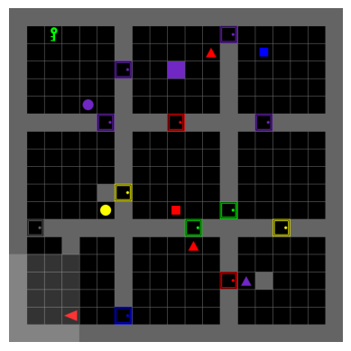          | goal is not specified                                                        |
|   `MiniGrid-Unlock`   | MiniGrid | 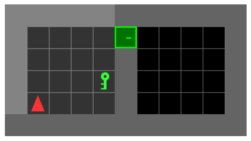              | unlock the door with the key                                                 |
|   `MiniGrid-UnlockPickUp`   | MiniGrid | 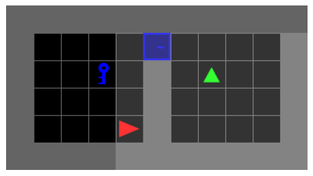        | unlock the door and pick up the object in another room                       |
|   `MiniGrid-BlockedUnlockPickUp`   | MiniGrid | 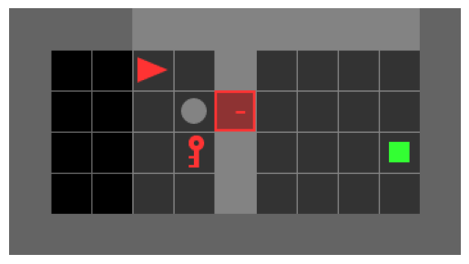 | unlock the door blocked by the object and pick up the object in another room |
|   `MiniGrid-DoorKey`   | MiniGrid | 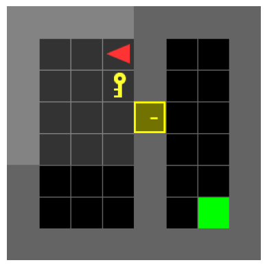             | unlock the door and go to the green goal                                     |

Users can get all registered environments with `xminigrid.registered_environments()`. We also provide manual control to easily explore the environments:
```commandline
python -m xminigrid.manual_control --env-id="MiniGrid-Empty-8x8"
```

## Baselines 🚀

In addition to the environments, we provide high-quality *almost* single-file 
implementations of recurrent PPO baselines in the style of [PureJaxRL](https://github.com/luchris429/purejaxrl). With the help of magical `jax.pmap` transformation 
they can scale to multiple accelerators, achieving impressive FPS of millions during training. 

Agents can be trained from the terminal and default arguments can be overwritten from the command line or from the yaml config:
```commandline
# for meta learning
python training/train_meta_task.py \
    --config-path='some-path/config.yaml' \
    --env_id='XLand-MiniGrid-R1-9x9'

# for minigrid envs
python training/train_singe_task.py \
    --config-path='some-path/config.yaml' \ 
    --env_id='XLand-MiniGrid-R1-9x9'
```
For the source code and hyperparameters available see [/training](training) or run `python training/train_meta_task.py --help`. 
Furthermore, we provide standalone implementations that can be trained in Colab:
[xland](examples/train_meta_standalone.ipynb),
[minigrid](examples/train_single_standalone.ipynb). 

**P.S.** Do not expect that provided baselines will solve the hardest environments or benchmarks 
available. How much fun would that be 🤔? However, we hope that they will 
help to get started quickly!

## Open Logs 📽

We value openness and reproducibility in science, therefore all logs for the main experiments 
from the paper are open and available as a [public wandb report](https://wandb.ai/state-machine/xminigrid/reports/XLand-MiniGrid-Public-Logs--Vmlldzo4NjUxMTcw).
There you can discover all the latest plots, the behaviour of the losses, and exactly see the hyperparameters used. Enjoy!

## Contributing 🔨

We welcome anyone interested in helping out! Please take a look at our [contribution guide](CONTRIBUTING.md) 
for further instructions and open an issue if something is not clear.

## See Also 🔎

A lot of other work is going in a similar direction, transforming RL through JAX. Many of them have inspired us, 
and we encourage users to check them out as well.

- [Brax](https://github.com/google/brax) - fully differentiable physics engine used for research and development of robotics.
- [Gymnax](https://github.com/RobertTLange/gymnax) - implements classic environments including classic control, bsuite, MinAtar and simplistic meta learning tasks.
- [Jumanji](https://github.com/instadeepai/jumanji) - a diverse set of environments ranging from simple games to NP-hard combinatorial problems.
- [Pgx](https://github.com/sotetsuk/pgx) - JAX implementations of classic board games, such as Chess, Go and Shogi.
- [JaxMARL](https://github.com/flairox/jaxmarl) - multi-agent RL in JAX with wide range of commonly used environments.
- [Craftax](https://github.com/MichaelTMatthews/Craftax) - Crafter reimplementation with JAX.
- [Purejaxql](https://github.com/mttga/purejaxql?tab=readme-ov-file) - off-policy Q-learning baselines with JAX for single and multi-agent RL.

Let's build together!

## Citation 🙏

```bibtex
@inproceedings{
    nikulin2023xlandminigrid,
    title={{XL}and-MiniGrid: Scalable Meta-Reinforcement Learning Environments in {JAX}},
    author={Alexander Nikulin and Vladislav Kurenkov and Ilya Zisman and Viacheslav Sinii and Artem Agarkov and Sergey Kolesnikov},
    booktitle={Intrinsically-Motivated and Open-Ended Learning Workshop, NeurIPS2023},
    year={2023},
    url={https://openreview.net/forum?id=xALDC4aHGz}
}
```
